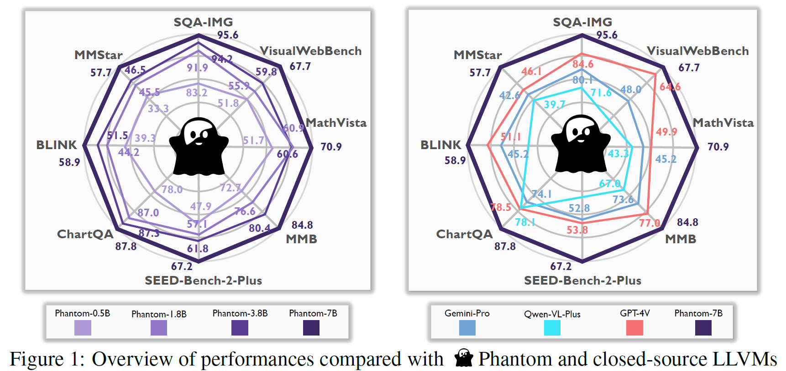
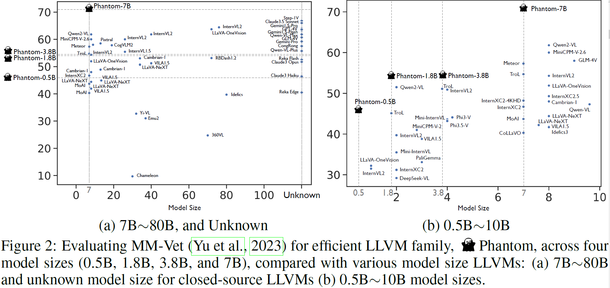
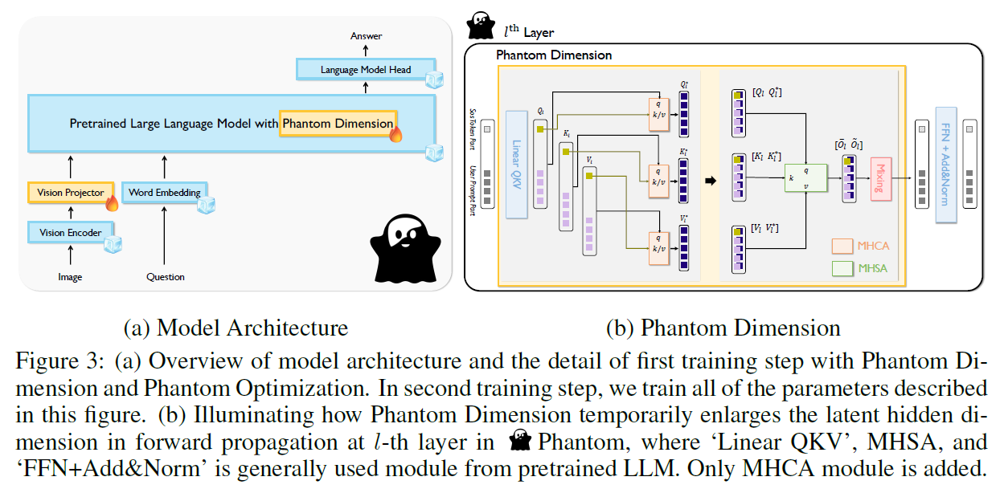

# Phantom of Latent for Large Language and Vision Models

## 📰 News
- Phantom-0.5B|1.8B|3.8B/7B has been released in 🤗 [Huggingface Models](https://huggingface.co/BK-Lee).
- Preprint of Phantom has been uploaded in [ArXiv](https://arxiv.org/abs/2409.14713).
- Phantom Triples Dataset for DPO-like concept has been released in 🤗 [Huggingface Datasets](https://huggingface.co/datasets/BK-Lee/Phantom).
- The demo code of Phantom-0.5B|1.8B|3.8B|7B has been updated in [this repository](https://github.com/ByungKwanLee/Phantom/blob/master/demo.py).
- Online demo for Phantom-0.5B|1.8B|3.8B|7B will be soon released in 🤗 [Huggingface Spaces](https://huggingface.co/spaces/BK-Lee/Phantom).
- The code of fintuning Phantom-0.5B|1.8B|3.8B|7B will be soon updated in this repository.

Official PyTorch implementation code for realizing the technical part of *Phantom of Latent* to improve numerous vision language performances with efficient model size. This code is developed from scratch, where the model architecture and all configurations are inspired by [InternVL](https://github.com/OpenGVLab/InternVL?tab=readme-ov-file). I have been trying to improve the readibility and simplicity of the code, compared with [LLaVA](https://github.com/haotian-liu/LLaVA) which has relatively complexly structured code.


## 💡 Highlights, Preview of Papers

Figure1.


Figure2.


Figure3.



## 🚪 How to run the local demo?

```python
import torch
from config import *
from PIL import Image
from utils.utils import *
from model.load_model import load_model
from torchvision.transforms.functional import pil_to_tensor


# model selection
size = '7b' # [Select One] '0.5b' (transformers more recent version) | '1.8b' | '3.8b' (transformers==4.37.2) | '7b'

# User prompt
prompt_type="with_image" # Select one option "text_only", "with_image"
img_path='figures/demo.png'
question="Describe the image in detail"

# loading model
model, tokenizer = load_model(size=size)

# prompt type -> input prompt
if prompt_type == 'with_image':
    # Image Load
    image = pil_to_tensor(Image.open(img_path).convert("RGB"))
    inputs = [{'image': image, 'question': question}]
elif prompt_type=='text_only':
    inputs = [{'question': question}]

# cpu -> gpu
for param in model.parameters():
    if not param.is_cuda:
        param.data = param.cuda()

# Generate
with torch.inference_mode():

    # Model
    _inputs = model.eval_process(inputs=inputs,
                                data='demo',
                                tokenizer=tokenizer,
                                device='cuda:0')
    generate_ids = model.generate(**_inputs, do_sample=False, max_new_tokens=256)
answer = tokenizer.batch_decode(generate_ids, skip_special_tokens=True)[0]
print(answer)

```

## 📋 Gathered Dataset Description
``` shell
Dataset Description (Total: 2852771, 2.8M)

------------------------------
* Real-World Image: 1218630, 1.2M
* Real-World Text: 143000, 143K
* Document & Chart & Diagram & Sign & Symbol: 743850, 744k
* Math: 747291, 747k
    - Math with Vision: 180497, 180k
    - Math with Text only: 566794, 566k
------------------------------

- ShareGPT4O-Images (57289, 57k)
- ShareGPT4V-Caption [without SAM] (91021, 91k)
- ShareGPT4V-Instruction [Without few samples of OCR-VQA] (664703, 664k)
- ALLAVA4V-VFLAN based on MiniGemini-Pretrain/Instruct (405617, 405k)
- ALLAVA4V-Text (143000, 143k)
- MiniGemini-Instruction [DocVQA, ChartQA, DVQA, AI2D] (27670, 27k)
- SMR [ArXivQA, TextbookQA] (116035, 116K)
- DocDownstream (574268, 574k)
- DocReason (25877, 25k)
- GLLaVA-Align (60252, 60k)
- GLLaVA-QA (117205, 117k)
- MathVision (3040, 3k)
- MathInstruct [TextOnlyDataset] (262040, 262k)
- MathPlus [TextOnlyDataset] (304754, 304k)
```

## 🔥 Curated Phantom Dataset Description
``` shell
Dataset Description (Total 2040186, 2.0M)

--------------------------------------------
* Real-World Image: 871160, 871k
* Real-World Text: 102389, 102k
* Document & Chart & Diagram & Sign & Symbol: 529709, 529k
* Math: 536928, 536k
    - Math with Vision: 129694, 129k
    - Math with Text only: 407234, 407k
--------------------------------------------

- ShareGPT4O-Images (40106, 40k)
- ShareGPT4V-Caption [without SAM] (64925, 64k)
- ShareGPT4V-Instruction [Without few samples of OCR-VQA] (475669, 475k)
- ALLAVA4V-VFLAN based on MiniGemini-Pretrain/Instruct (290460, 290k)
- ALLAVA4V-Text (102389, 102k)
- MiniGemini-Instruction [DocVQA, ChartQA, DVQA, AI2D] (19363, 19k)
- SMR [ArXivQA, TextbookQA] (82843, 82K)
- DocDownstream (409140, 409k)
- DocReason (18363, 18k)
- GLLaVA (127484, 127k)
- MathVision (2210, 2k)
- MathInstruct [TextOnlyDataset] (188288, 188k)
- MathPlus [TextOnlyDataset] (218946, 218k)
```


## 🚀 Download Training Datasets

We collect the following eight datasets. For MiniGemini, we selectively use data samples only for DocVQA, ChartQA, DVQA, and AI2D. Therefore, it is no need for you to download all data samples for MiniGemini.

* ShareGPT4V [[link](https://github.com/InternLM/InternLM-XComposer/blob/main/projects/ShareGPT4V/docs/Data.md)]
* ALLAVA4V-VFLAN[[link](https://huggingface.co/datasets/Vision-Flan/vision-flan_191-task_1k/tree/main)]
* ALLAVA4V-Text [[link](https://huggingface.co/datasets/FreedomIntelligence/ALLaVA-4V/viewer/allava_text)]
* MiniGemini [[link](https://github.com/dvlab-research/MiniGemini)]
* SMR [[link](https://huggingface.co/datasets/yifanzhang114/SMR)]
* DocDownstream [[link](https://huggingface.co/datasets/mPLUG/DocDownstream-1.0)]
* DocReason [[link](https://huggingface.co/datasets/mPLUG/DocReason25K)]
* GLLaVA [[link](https://huggingface.co/datasets/Luckyjhg/Geo170K)]
* MathVision [[link](https://huggingface.co/datasets/mathvision/mathvision)]
* MathInstruct [[link](https://huggingface.co/datasets/TIGER-Lab/MathInstruct)]
* MathPlus [[link](https://huggingface.co/datasets/TIGER-Lab/MATH-plus)]

Gathered Dataset Layout
```bash
Phantom_Dataset_Path
├── llava                                                       # ShareGPT4V
│   └── llava_pretrain                  
│       └── images                  
├── coco                                                        # ShareGPT4V
│   └── train2017                   
├── sam                                                         # ShareGPT4V
│   └── images                  
├── gqa                                                         # ShareGPT4V
│   └── images                  
├── ocr_vqa                                                     # ShareGPT4V
│   └── images                  
├── textvqa                                                     # ShareGPT4V
│   └── train_images                    
├── vg                                                          # ShareGPT4V
│   ├── VG_100K                 
│   └── VG_100K_2                   
├── share_textvqa                                               # ShareGPT4V
│   └── images                  
├── web-celebrity                                               # ShareGPT4V
│   └── images                  
├── web-landmark                                                # ShareGPT4V
│   └── images                  
├── wikiart                                                     # ShareGPT4V
│   └── images                  
├── share_textvqa                                               # ShareGPT4V
│   └── images                  
├── docvqa                                                      # MiniGemini
│   └── images                  
├── chartqa                                                     # MiniGemini
│   └── train                   
│       └── images                  
├── dvqa                                                        # MiniGemini
│   └── images                  
├── ai2d                                                        # MiniGemini
│   └── images                  
├── ALLaVA-4V                                                   # MiniGemini (ALLAVA-VFLAN)
│   └── allava_vflan
│       └── images
├── arxivqa                                                     # SMR (ArXivQA)
│   └── images
├── TextbookQA                                                  # SMR (TextbookQA)
│   └── train
│   └── val 
├── imgs                                                        # DocDownstream & DocReason
│   └── ChartQA
│   └── DUE_Benchmark
│       └── DeepForm
│       └── DocVQA
│       └── InfographicsVQA
│       └── KleisterCharity
│       └── TabFact
│       └── WikiTableQuestions
│   └── TextCaps
│   └── TextVQA
│   └── VisualMRC
├── geo3k                                                       # GLLaVA
|   └── train
├── geoqa_plus                                                  # GLLaVA
├── images                                                      # MathVision
|
├── sharegpt4v_instruct_gpt4-vision_cap100k.json                # ShareGPT4V-Caption
├── sharegpt4v_mix665k_cap23k_coco-ap9k_lcs3k_sam9k_div2k.json  # ShareGPT4V-Instruction
├── Evol-Instruct-GPT4-Turbo-143K.json                          # ALLAVA4V-Text
├── SMR.json                                                    # SMR
├── train.jsonl                                                 # DocDownstream
├── detailed_explanation.jsonl                                  # DocReason
├── minigemini_pretrain.json                                    # MiniGemini-Pretrain
├── minigemini_instruction.json                                 # MiniGemini-Instruction
├── gllava_align.parquet                                        # GLLaVA-Align
├── gllava_qa.parquet                                           # GLLaVA-QA
├── mathvision.parquet                                          # MathVision
├── MathInstruct.json                                           # MathInstruct
└── mathplus.parquet                                            # MathPlus
```

## 📂 Evaluation Benchmarks

These are the list of evaluation datasets. If you completely download them, the dataset should be placed in the folder by the following below directory layout.

* SQA-IMG [[link](https://scienceqa.github.io/)]
* AI2D [[link](https://allenai.org/data/diagrams)]
* ChartQA [[link](https://huggingface.co/datasets/HuggingFaceM4/ChartQA)]
* SEED [[link](https://github.com/AILab-CVC/SEED-Bench)]
* SEED-Bench-2-Plus [[link](https://huggingface.co/datasets/doolayer/SEED-Bench-2-Plus)]
* POPE [[link](https://github.com/RUCAIBox/POPE)]
* HallusionBench [[link](https://github.com/tianyi-lab/HallusionBench)]
* MME [[link](https://github.com/BradyFU/Awesome-Multimodal-Large-Language-Models/tree/Evaluation)]
* MathVista [[link](https://github.com/lupantech/MathVista)]
* MMB [[link](https://github.com/open-compass/MMBench?tab=readme-ov-file)]
* MM-Vet [[link](https://github.com/yuweihao/MM-Vet)]
* MM-Vet-v2 [[link](https://huggingface.co/datasets/whyu/mm-vet-v2)]
* LLaVA-W [[link](https://huggingface.co/datasets/liuhaotian/llava-bench-in-the-wild)]
* LLaVA-Wilder [[link](https://huggingface.co/datasets/lmms-lab/LLaVA-Bench-Wilder)]
* BLINK [[link](https://huggingface.co/datasets/BLINK-Benchmark/BLINK)]
* CV-Bench [[link](https://huggingface.co/datasets/nyu-visionx/CV-Bench)]
* VisualWebBench [[link](https://huggingface.co/datasets/visualwebbench/VisualWebBench)]
* MMStar [[link](https://huggingface.co/datasets/Lin-Chen/MMStar)]
* MathVerse [[link](https://huggingface.co/datasets/AI4Math/MathVerse)]

Evaluation Dataset Directory Layout
```bash
Evaluation_Dataset_Path
├── ScienceQA                       # SQA-IMG
├── ai2d                            # AI2D
├── chartqa                         # ChartQA
├── SEED-Bench                      # SEED-IMG
├── SEED-Bench-2-plus               # SEED-Bench-2-Plus
├── POPE                            # POPE
├── HallusionBench                  # HallusionBench
├── MME_Benchmark_release_version   # MME
├── MathVista                       # MathVista
├── MMBench                         # MMB
├── mm-vet                          # MM-Vet
├── mm-vet-v2                       # MM-Vet-v2
├── llava-bench-in-the-wild         # LLaVA Bench in the Wild
├── LLaVA-Bench-Wilder              # LLaVA Wilder
├── BLINK                           # BLINK
├── CV-Bench                        # CV-Bench
├── VisualWebBench                  # VisualWebBench
├── MMStar                          # MMStar
└── MathVerse                       # MathVerse
```
